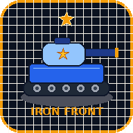

# Iron Front: Tactics



**Iron Front: Tactics** is a feature-rich, high-performance turn-based tactical strategy game built with React 19, Vite, Tailwind CSS, and HTML5 Canvas, packaged for Android using Capacitor.

Inspired by classic turn-based tactics games, *Iron Front: Tactics* features deep strategic combat across 25 story campaign missions, 10 officers with unique powers and ultimate abilities, 19 unit types across land, air, and naval branches, custom unit upgrade tracks, tactical skills, online multiplayer (PvP & Co-op), and dynamic performance tuning.

---

## 🌟 Key Features

- **📱 Fully Responsive Dynamic Screen Scaling:**
  - Auto-fits all phone display aspect ratios (including **Google Pixel 9**, 19.5:9 / 20:9 screens, tablets, and desktop displays).
  - Respects device safe area insets (`env(safe-area-inset-*)`) for display cutouts, camera punch-holes, and gesture navigation bars.
  - Dynamic camera panning, map tile autoscaling, and HUD element height adaptation.

- **⚡ High Refresh Rate & Smooth Performance (P1):**
  - Buttery smooth rendering loop supporting **90Hz, 120Hz, 144Hz+** high refresh rate displays.
  - Full delta-time (`dtFactor`) game tick for frame-rate-independent physics, particle effects, floating damage text, and smooth camera panning.
  - Automatic hardware spec detection (CPU cores, estimated RAM, WebGL GPU tier) on startup, selecting the optimal graphics preset.
  - In-game **Graphics & Performance Settings** modal with configurable FPS targets (Uncapped 120Hz+, 120, 90, 60, 30), canvas resolution scale (DPR), particle density, and weather effects toggle.

- **🎖️ Tank-Based App Icon (P3):**
  - Stylized custom tank app icon featuring metallic armor, dual treads, star emblem, and long cannon barrel.
  - Provided in vector SVG (`public/icon.svg`), high-res PNG formats (`512x512`, `192x192`, `apple-touch-icon.png`), and auto-generated Android launcher mipmaps (`ic_launcher.png`, `ic_launcher_round.png`, `ic_launcher_foreground.png`).

- **📜 Expanded 10-Act Campaign (P4):**
  - **25 Story Campaign Missions** spanning 10 Acts:
    - *Boot Camp* (Interactive Tutorial)
    - *Act I — Border Fire*
    - *Act II — Skies of Ash*
    - *Act III — The Iron Throne*
    - *Act IV — Ghost Protocol*
    - *Act V — The Final Signal*
    - *Act VI — Fractured Peace*
    - *Act VII — Zero Dawn*
    - *Act VIII — Desert Citadel*
    - *Act IX — Citadel of Shadows*
    - *Act X — Apex Vanguard*
  - Rich briefing and debriefing dialogues, multi-phase boss encounters (*The Warden*, *Skybreaker*, *Singularity Core*, *Apex Warden*, *Apex Core*), fog-of-war, dynamic weather, and first-clear skill rewards.

- **🔧 Expanded Upgrades & Tactical Skills (P4):**
  - **Unit Upgrade Tracks:** Firepower, Heavy Plating, Light Frame, Mass Production, Extended Barrel, and Tactical Subsystems up to Level 5.
  - **Tactical CO Skills:** 24 unlockable skills including *Air Strike*, *Nanite Surge*, *Overdrive*, *Aegis Shield*, *Ghost Camo*, *Airborne Resupply*, and *Orbital Beam*.
  - **10 Unique Commanders:** Rhea Vance, Dax Kord, Sora Akai, Mira Tull, Brann Hale, Grimm, Frost, Nyx, Volkov, and The Architect.

- **🌐 Online PvP & Co-op:**
  - Real-time online rooms powered by PeerJS for head-to-head tactical battles and co-op campaign play.

---

## 🚀 Deployment Instructions

### Primary: Deploy via Dokploy & Cloudflare Proxy

*Iron Front: Tactics* is packaged with a multi-stage `Dockerfile` and `docker-compose.yml` optimized for containerized deployment on Dokploy behind a Cloudflare domain proxy.

1. **Push Repository to GitHub / Git Provider.**
2. **In Dokploy:**
   - Create a new **Application**.
   - Select your Git repository.
   - Set Build Type to **Docker** (or Docker Compose).
   - Set Port Mapping to `8080:80` (or internal port `80`).
3. **Cloudflare Setup:**
   - Point your domain's A/AAAA CNAME record to your Dokploy server IP with **Proxy Enabled (Orange Cloud)**.
   - SSL/TLS mode: **Full (Strict)**.

#### Local Docker Test
```bash
docker build -t iron-front-tactics .
docker run -d -p 8080:80 --name iron-front-tactics iron-front-tactics
```
Access the application at `http://localhost:8080`.

---

### Fallback: Deployment on Ubuntu Server (VPS)

1. **Install Node.js 22 & Nginx:**
   ```bash
   curl -fsSL https://deb.nodesource.com/setup_22.x | sudo -E bash -
   sudo apt-get install -y nodejs nginx
   ```
2. **Build Web Frontend:**
   ```bash
   git clone <your-repo-url> iron-front-tactics
   cd iron-front-tactics
   npm install
   npm run build
   ```
3. **Configure Nginx:**
   ```nginx
   server {
       listen 80;
       server_name your-domain.com;
       root /path/to/iron-front-tactics/dist;
       index index.html;

       location / {
           try_files $uri $uri/ /index.html;
       }
   }
   ```
4. **Restart Nginx:**
   ```bash
   sudo systemctl restart nginx
   ```

---

## 📱 Android Debug APK Build

To build an installable Android APK locally:

```bash
bash scripts/build-apk.sh
```

- Output APK: `iron-front-debug.apk`
- The script automatically handles Capacitor Android sync, landscape orientation configuration, immersive fullscreen system bar flags, v1/v2/v3 APK signing, and tank mipmap icon generation.

---

## 🔌 Exposed Network Ports

| Service | Container Port | Host Port (Default) | Description |
| :--- | :--- | :--- | :--- |
| **Web Server (Nginx)** | `80` | `8080` (or `80`) | Serves production web client assets |

---

## 🔒 Security & Quality Assurance

- **No Plaintext Credentials:** All sensitive configurations use environment variables; no static keys or plaintext credentials are stored.
- **Client Sanitization:** Input handling and peer-to-peer room connections validate incoming data payloads against schema constraints.
- **Robust Error Bounds:** React error boundaries (`ErrorBoundary.tsx`) trap unexpected runtime exceptions without crashing the user's session.
